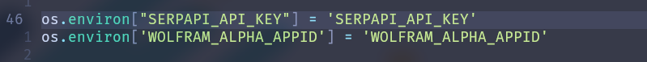

<div align="center"><p>
    <a href="https://github.com/Zulqarnain-cc34/Wolframalpha_Langchain/releases/latest">
      
    </a>
    <a href="https://github.com/Zulqarnain-cc34/Wolframalpha_Langchain/pulse">
      
    </a>
    <a href="https://github.com/Zulqarnain-cc34/Wolframalpha_Langchain/blob/main/LICENSE">
      
    </a>
    <a href="https://github.com/Zulqarnain-cc34/Wolframalpha_Langchain/stargazers">
      
    </a>
    <a href="https://github.com/Zulqarnain-cc34/Wolframalpha_Langchain">
      
    </a>
</div>


# Wolfram Alpha Wrapper

Wolfram Alpha tool wrapper is a Python tool that provides an extended wrapper for Wolfram Alpha API. It allows you to retrieve plot images and step-by-step solutions for a given query.

### Features

- **Plot Retrieval**: Obtains url of plot images for a given query.
- **Step-by-Step Solutions**: Get step-by-step solutions for a query.

### Getting Started

1. Obtain a Wolfram Alpha App ID.
2. Set the `WOLFRAM_ALPHA_APPID` environment variable with your App ID.
3. Set the `SERPAPI_API_KEY` environment variable with your App ID.

To change it in `chat.py`.

<div>
  
</div>

In case you want to use Docker. To run use `docker build .`

### Query

To change the `test.py` file and run using python.

```python

url = "http://172.17.0.2:5000/prompt"

headers = {
    'Content-Type': 'application/json',
    'API-KEY': 'API-KEY'
}

data = {'prompt': 'Paste prompt here'}

response = requests.post(url, headers=headers, json=data)

print(response.text)

```
